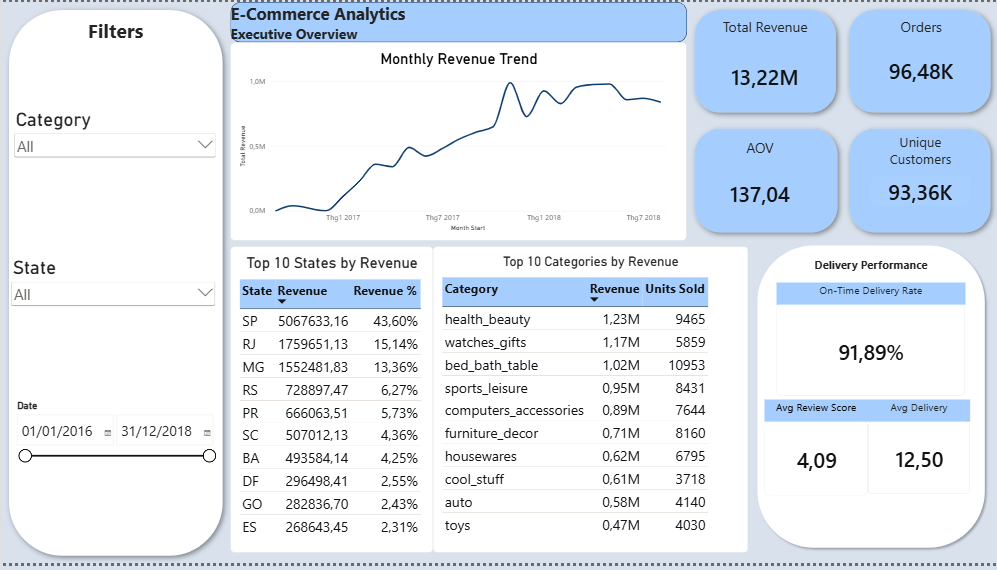

# E-Commerce Sales & Customer Analytics

An end-to-end data analytics project analyzing e-commerce sales, customer behavior, product performance, geographic performance, and delivery operations using SQL Server, Python, and Power BI.

The project demonstrates a complete analytics workflow from raw data ingestion and data quality validation to exploratory analysis, cohort retention analysis, and an interactive executive dashboard.

---

## Project Overview

This project analyzes the [Olist Brazilian E-Commerce Public Dataset](https://www.kaggle.com/datasets/olistbr/brazilian-ecommerce) to answer key business questions related to:

- Sales performance and revenue trends
- Customer purchasing behavior and retention
- Product and category performance
- Geographic market performance
- Delivery reliability
- Customer satisfaction

The analysis follows a layered workflow:

```text
Raw CSV Data
     ↓
SQL Server
     ↓
Data Quality & Cleaning
     ↓
SQL Business Analysis
     ↓
Python EDA & Cohort Analysis
     ↓
Power BI Dashboard
```

---

## Business Questions

The project focuses on answering the following questions:

### Sales
- How much revenue was generated?
- How did revenue and order volume change over time?
- Was revenue growth driven by order volume or average order value?
- Which months generated the highest revenue?

### Customers
- How many unique customers purchased from the platform?
- What percentage of customers made repeat purchases?
- How valuable are repeat customers compared with one-time customers?
- How does customer retention change after the first purchase?

### Products
- Which product categories generate the most revenue?
- Which categories have the highest sales volume?
- Are high-volume categories also the highest-revenue categories?

### Geography
- Which states contribute the most revenue?
- Which geographic markets contain the largest customer base?
- Do smaller markets have different average order values?

### Operations
- How long does delivery typically take?
- What percentage of delivered orders arrive on time?
- How does late delivery relate to customer review scores?

---

## Tech Stack

| Tool | Purpose |
|------|---------|
| SQL Server | Database storage, cleaning, data quality checks, and analysis |
| T-SQL | Business analysis and reusable analytical queries |
| Python | Exploratory data analysis and cohort retention analysis |
| pandas | Data manipulation and aggregation |
| NumPy | Feature engineering |
| Matplotlib | Data visualization |
| pyodbc | Python-to-SQL Server connection |
| Power BI | Data modeling, DAX measures, and executive dashboard |
| Git / GitHub | Version control and project documentation |

---

## Dataset

The project uses the [Olist Brazilian E-Commerce Public Dataset](https://www.kaggle.com/datasets/olistbr/brazilian-ecommerce).

The main datasets include:

- Customers
- Orders
- Order items
- Products
- Payments
- Reviews
- Product category translations

> Raw CSV files are intentionally excluded from the repository.

---

## Data Quality and Cleaning

Data quality checks were performed before analysis.

Key observations included:

- `orders` contains missing delivery timestamps for cancelled, shipped, unavailable, and other incomplete order statuses.
- Eight delivered orders have missing customer delivery timestamps and are excluded from delivery-time analysis.
- Product metadata contains missing category and dimension information.
- Review titles and messages contain many null values because customers can submit ratings without written comments.
- Some orders contain multiple review records.
- Product prices, freight values, and payment values required scaling correction after ingestion.

Instead of modifying the raw tables, reusable SQL views were created:

- `vw_order_items_clean`
- `vw_payments_clean`
- `vw_products_clean`

This preserves the original raw data while providing cleaned analytical tables.

---

## Key KPIs

| KPI | Value |
|-----|-------|
| Total Revenue | 13,221,498.11 |
| Delivered Orders | 96,478 |
| Unique Customers | 93,358 |
| Average Order Value | 137.04 |
| Repeat Customer Rate | 3.00% |
| On-Time Delivery Rate | 91.89% |
| Average Delivery Time | 12.50 days |
| On-Time Delivery Review Score | 4.29 |
| Late Delivery Review Score | 2.57 |

> Revenue represents product sales from delivered orders and excludes freight charges.

---

## Key Insights

### 1. Revenue growth was mainly driven by order volume

Revenue increased substantially during 2017. The highest-revenue month was **November 2017**, generating approximately:

| Metric | Value |
|--------|-------|
| Revenue | 987,765.37 |
| Orders | 7,289 |
| AOV | 135.51 |

Revenue increased by approximately **52.37%** month-over-month, while order volume increased by approximately **62.77%**. Average order value did not increase at the same rate, indicating that the revenue spike was primarily driven by transaction volume.

---

### 2. The customer base is dominated by one-time buyers

| Segment | Count |
|---------|-------|
| One-Time Customers | 90,557 |
| Repeat Customers | 2,801 |

Only around **3%** of customers made more than one delivered purchase. However, repeat customers generated significantly more revenue per customer:

| Segment | Avg Revenue |
|---------|-------------|
| One-Time Customer | ~137.96 |
| Repeat Customer | ~260.05 |

This suggests that repeat customers represent a relatively small but valuable customer segment.

---

### 3. Cohort retention is very low

Cohort analysis grouped customers according to the month of their first delivered purchase. Weighted customer retention was approximately:

| Period | Retention Rate |
|--------|---------------|
| Month 1 | 0.48% |
| Month 2 | 0.34% |
| Month 3 | 0.26% |

Retention remained below **1%** for most observed cohort periods. This supports the broader finding that the business relies heavily on customer acquisition rather than frequent repeat purchasing.

---

### 4. Product performance differs by revenue and sales volume

The highest-revenue category was:

| Category | Revenue | Units Sold |
|----------|---------|------------|
| health_beauty | ~1.23M | 9,465 |

The highest-volume category was:

| Category | Units Sold | Revenue |
|----------|------------|---------|
| bed_bath_table | 10,953 | ~1.02M |

`watches_gifts` generated approximately **1.17M** in revenue despite lower sales volume because of its relatively higher average item price. This shows that product performance should be evaluated using both revenue and unit volume.

---

### 5. São Paulo is the largest geographic market

São Paulo (SP) generated approximately:

| Metric | Value |
|--------|-------|
| Revenue | 5.07M |
| Orders | 40,501 |
| Customers | 39,156 |
| AOV | 125.12 |

It represents the largest market by customer count, orders, and revenue. Rio de Janeiro (RJ) and Minas Gerais (MG) were the next largest markets.

---

### 6. Delivery reliability is strongly associated with customer satisfaction

Among valid delivered orders:

| Metric | Value |
|--------|-------|
| On-Time Deliveries | 91.89% |
| Late Deliveries | 8.11% |
| Average Delivery Time | 12.50 days |

Customer satisfaction differed substantially between on-time and late orders:

| Metric | On-Time | Late |
|--------|---------|------|
| Avg Review Score | 4.29 | 2.57 |
| Positive Review Rate | 82.79% | 34.55% |

The results show a strong association between delivery reliability and review score. This relationship should be interpreted as an association rather than proof that late delivery alone causes lower customer satisfaction.

---

## SQL Analysis

The SQL phase contains reusable scripts covering the complete analysis workflow.

```text
sql/
├── 01_create_database.sql
├── 02_create_tables.sql
├── 03_data_quality_checks.sql
├── 04_data_cleaning.sql
├── 05_sales_analysis.sql
├── 06_customer_analysis.sql
├── 07_product_analysis.sql
└── 08_operations_analysis.sql
```

### Main SQL topics demonstrated

- Data quality validation
- Missing-value analysis
- Referential integrity checks
- SQL views
- Aggregations
- Common Table Expressions (CTEs)
- Window functions (`ROW_NUMBER`, `LAG`, `NTILE`)
- Customer segmentation
- RFM analysis
- Time-series analysis
- Revenue contribution analysis
- Delivery performance analysis

---

## Python Analysis

Two Python notebooks extend the SQL analysis without duplicating the entire SQL workflow.

### `01_python_eda.ipynb`

Exploratory analysis covering:

- Data validation
- Feature engineering
- Monthly revenue trends
- Order volume
- Average order value
- Customer behavior
- Product categories
- Geographic performance
- Delivery and customer satisfaction

> Python KPI results were validated against SQL results to ensure consistency across analytical layers.

### `02_cohort_retention.ipynb`

Customer cohort analysis covering:

- Customer acquisition cohorts
- Months since first purchase
- Retention matrix
- Observation-window handling
- Retention heatmap
- Average retention
- Weighted retention

---

## Power BI Dashboard

The Power BI report provides a one-page executive overview combining the most important findings from the SQL and Python analysis.

### Dashboard Components

```text
Filters
├── Category
├── State
└── Date

Core KPIs
├── Total Revenue
├── Total Orders
├── Unique Customers
└── Average Order Value

Sales Analysis
└── Monthly Revenue Trend

Geographic Analysis
└── Top 10 States by Revenue

Product Analysis
└── Top 10 Categories by Revenue

Delivery Performance
├── On-Time Delivery Rate
├── Average Delivery Days
└── Average Review Score
```

### Dashboard Preview



---

## Data Model

The Power BI model uses a structured fact/dimension approach.

```text
               Dim_Date
                  |
                  |
Dim_Customers ── Fact_Orders ── Fact_OrderItems ── Dim_Products
                  |
                  |
            Fact_Reviews
```

Key relationships include:

- `Dim_Customers[customer_id]` → `Fact_Orders[customer_id]`
- `Dim_Date[Date]` → `Fact_Orders[order_purchase_date]`
- `Fact_Orders[order_id]` → `Fact_OrderItems[order_id]`
- `Dim_Products[product_id]` → `Fact_OrderItems[product_id]`
- `Fact_Orders[order_id]` → `Fact_Reviews[order_id]`

> Reviews were deduplicated to one review per order before being used in the Power BI model.

---

## Repository Structure

```text
ecommerce-data-analytics/
│
├── data/
│   └── raw/
│       └── (Raw CSV files excluded from Git)
│
├── sql/
│   ├── 01_create_database.sql
│   ├── 02_create_tables.sql
│   ├── 03_data_quality_checks.sql
│   ├── 04_data_cleaning.sql
│   ├── 05_sales_analysis.sql
│   ├── 06_customer_analysis.sql
│   ├── 07_product_analysis.sql
│   └── 08_operations_analysis.sql
│
├── notebooks/
│   ├── 01_python_eda.ipynb
│   └── 02_cohort_retention.ipynb
│
├── dashboard/
│   └── ecommerce_analytics_dashboard.pbix
│
├── images/
│   └── dashboard_overview.png
│
├── docs/
│
├── README.md
└── .gitignore
```

---

## How to Run

### 1. Clone the repository

```bash
git clone <your-repository-url>
cd ecommerce-data-analytics
```

### 2. Download the dataset

Download the [Olist Brazilian E-Commerce dataset](https://www.kaggle.com/datasets/olistbr/brazilian-ecommerce) and place the raw CSV files inside:

```text
data/raw/
```

> Raw data is not included in the Git repository.

### 3. Set up SQL Server

Run the SQL scripts in order:

1. `01_create_database.sql`
2. `02_create_tables.sql`
3. `03_data_quality_checks.sql`
4. `04_data_cleaning.sql`
5. `05_sales_analysis.sql`
6. `06_customer_analysis.sql`
7. `07_product_analysis.sql`
8. `08_operations_analysis.sql`

> Import the corresponding CSV datasets into SQL Server before running the analysis scripts.

### 4. Run Python notebooks

Install required Python packages:

```bash
pip install pandas numpy matplotlib pyodbc ipykernel
```

> Update the SQL Server connection settings if required.

Then run:

- `notebooks/01_python_eda.ipynb`
- `notebooks/02_cohort_retention.ipynb`

### 5. Open the Power BI dashboard

Open:

```text
dashboard/ecommerce_analytics_dashboard.pbix
```

> Update the SQL Server data source if the database is hosted on a different SQL Server instance.

---

## Analytical Notes

Several business rules were applied consistently across SQL, Python, and Power BI:

| Rule | Definition |
|------|------------|
| Revenue | Product price from delivered orders — freight excluded |
| Orders | Distinct delivered order IDs |
| Customers | `customer_unique_id` |
| AOV | Revenue / Distinct Delivered Orders |
| Delivery Analysis | Delivered orders with valid customer delivery timestamps |
| On-Time Delivery | Actual delivery date ≤ Estimated delivery date |
| Review Analysis | One latest review per order |

These rules ensure that KPI definitions remain consistent across all analytical layers.

---

## Skills Demonstrated

This project demonstrates practical experience with:

- End-to-end data analytics workflows
- SQL data cleaning and validation
- Relational data modeling
- Analytical SQL
- Customer segmentation
- RFM analysis
- Cohort retention analysis
- Python exploratory analysis
- Business KPI design
- DAX
- Power BI data modeling
- Dashboard design
- Data storytelling
- Git and GitHub

---

## Future Improvements

Potential extensions include:

- Customer lifetime value (CLV) analysis
- More detailed retention segmentation
- Product-level profitability analysis (if cost data becomes available)
- Shipping carrier performance analysis
- Customer churn modeling
- Automated ETL pipelines
- Deployment of the dashboard to Power BI Service

---

## Author

**Nguyễn Mạnh Thắng**

Data Analytics / Data Science Portfolio Project